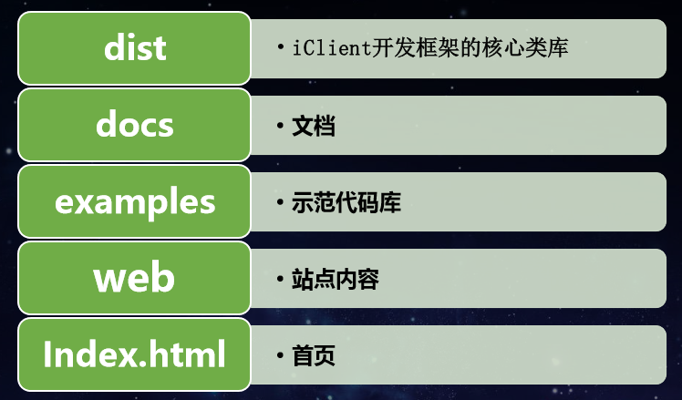

# WebGIS

## WebGIS 系统组成

- 数据 用与制作与发布地图服务
- 地图服务(地图(地形、矢量、栅格等) + 数据服务)
- web GIS client 用于可视化

## 二维WebGIS Client生态

### 常用开源框架

- OpenLayer 3/4 
- LeafLet 社区最大
- MapboxGL 

### 可视化拓展

- echarts
- D3
- MapV

### 文档与源代码

